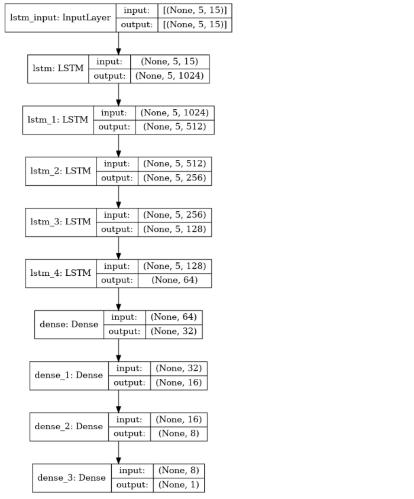
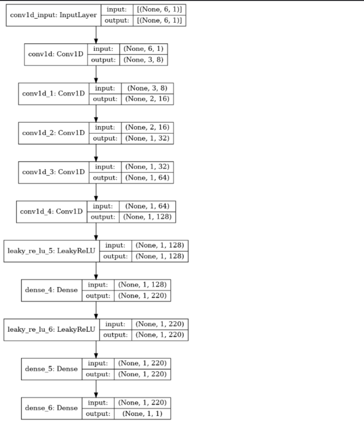
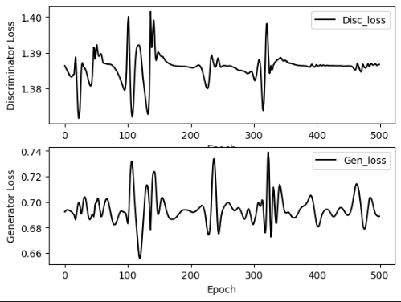
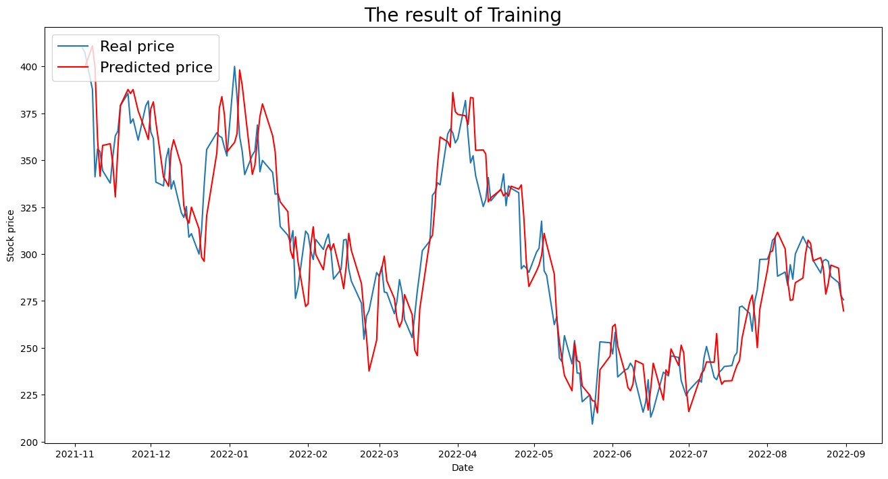
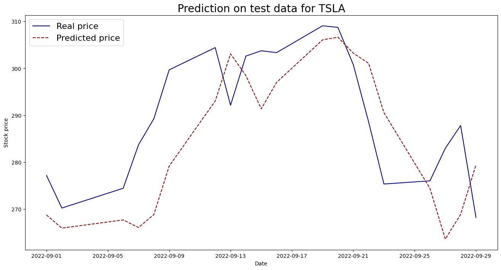

# **Tesla Stock Price Prediction with GANs and Sentiment Analysis**

## **Overview**
This project aims to predict **Tesla’s stock price** using a **combination of sentiment analysis on Twitter data(news) and technical indicators** derived from historical stock data. We leverage a **Generative Adversarial Network (GAN)** to produce synthetic time-series data and predict stock price trends. The generator creates plausible stock price sequences, while the discriminator distinguishes between real and synthetic data, improving the model's ability to capture market dynamics.

## **Dataset Overview**

### [**Stock Tweets for Sentiment Analysis and Prediction**](https://www.kaggle.com/datasets/equinxx/stock-tweets-for-sentiment-analysis-and-prediction)
This [**Dataset**](https://www.kaggle.com/datasets/equinxx/stock-tweets-for-sentiment-analysis-and-prediction) provides over **80,000+ tweets** related to the stock market, specifically selected for **sentiment analysis and stock price prediction** purposes. Collected across a one-year period, this dataset pairs Twitter sentiment with real-time stock data to aid in predictive modeling for stock market trends.

### **Dataset Details**
- **Time Period**: 30-09-2021 to 30-09-2022
- **Stock Coverage**: Contains tweets for the **top 25 most-watched stock** tickers on Yahoo Finance.
  
### **Dataset Description**
The dataset is split into two main files:

- **`stocks_tweets.csv`**: Contains tweet data relevant to the sentiment around specific stocks.
    - **Date**: Timestamp of the tweet.
    - **Tweet**: Full text of the tweet, providing insights into market sentiment.
    - **Stock Name**: Stock ticker symbol for the referenced company.
    - **Company Name**: Full company name for easy reference.

- **`stock_yfinance_data.csv`**: Includes stock market data from Yahoo Finance.
    - **Date**: Date corresponding to the market data.
    - **Open**: The price of the stock at the market open on that day.
    - **High**: The highest price of the stock during the trading day.
    - **Low**: The lowest price of the stock during the trading day.
    - **Close**: The closing price of the stock at the end of the trading day.
    - **Adj Close**: The closing price adjusted for dividends and stock splits.
    - **Volume**: The number of shares traded during the day.

### **Dataset Purpose**
This dataset combines market sentiment from Twitter and stock market metrics for a selected set of high-interest companies, creating a robust foundation for predictive modeling projects. It is especially suited for:
- **Sentiment Analysis**: Understanding the market sentiment surrounding popular stocks.
- **Stock Price Prediction**: Testing how public sentiment on social media correlates with real stock performance.

This structured combination of sentiment and market data allows for advanced analysis techniques, from sentiment-based predictive modeling to examining correlations between social media influence and stock market fluctuations.


## **Project Architecture**

### **1. Sentiment Analysis**
- **Sentiment Extraction**: We use **VADER** to calculate sentiment scores from Tesla-related Twitter news.
- **Feature Integration**: Sentiment scores are combined with other features such as *open, high, low, close, AdjClose, Volume and technical indicators(such as ) for model input.

### **2. GAN Architecture**
- **Generator Model**:
  - Uses **LSTM layers** to capture temporal dependencies in the stock price data.
  - Progressive dimensionality reduction from **high units (1024)** to **lower units (64)** to create abstract feature representations.
  - **Dense layers for output** processing to produce synthetic sequences in the same format as real data.

    

- **Discriminator Model**:
  - A **CNN-based** structure with **Conv1D** layers to process sequential data.
  - **LeakyReLU** activation to prevent dead neurons.
  - **Dense layers** leading to a **sigmoid output**, which assigns probabilities to identify real vs. synthetic sequences.

    

### **3. Model Training**
- **Training Data**: Historical stock data combined with sentiment scores and calculated technical indicators.
- **Adversarial Training Process**:
  - Generator and discriminator are trained in tandem to improve both the realism of synthetic data and the model’s ability to differentiate between real and synthetic data.

## **Features Used**
- **Sentiment Scores**: **VADER**-calculated sentiment scores from Tesla Twitter news.
- **Technical Indicators**: Includes **MA7, MA20,	MACD, 20SD,	upper_band, lower_band,	EMA, logmomentum** as technical indicators calculated from stock data. 
    
    Read [**Techincal_indicators.md**](Techincal_indicators.md) for explanation.
- **Price Data**: Historical **open, close, high, low, AdjClose, volume**.

## **Project Structure**
The project is organized into several directories, each with a specific purpose:

```
tesla-stock-prediction-gans/
├── Data/                  # Contains raw and preprocessed data files, including Twitter data and stock price history.
│   ├── norm_data          # processed data
│   ├── stock_tweets.csv   # raw data
│   └── stock_yfinance_data.csv
├── Models/                # Contains GAN models(training), including generator and discriminator architectures.
│   ├── Discriminator
│   └── Generator
├── Notebooks/              # Jupyter notebook
│   └── Stock_price_GAN.ipynb
|   
├── Output/                 # Outputs(data, technical indicator, model viz, training and test.)
│   ├── Data_outputs/       
│   ├── Model/
|   ├── Test/
|   └── Training/
├── Src/                        # All the working files
│   ├── config.py       
│   ├── imports.py              # All the imports
|   ├── model_dispatcher.py     # Generator and Discriminator Models
│   ├── plots.py                # All the plots
│   ├── preprocess.py           # Data preparation and Preprocessing
|   ├── train.py                
|   ├── test.py
|   └── main.py                 # Main script
├── requirements.txt       # List of dependencies and libraries needed to run the project.
├── README.md              # Project documentation file.
└── Technical_indicators.md
```

## **Getting Started**

### **Prerequisites**
- Python 3.x
- TensorFlow
- Keras
- NLTK

### **Installation and Usage**  
- **Clone the repository.**
   ```bash
   git clone https://github.com/Parshantkumar2033/STOCKS_PRICE_TESLA.git
   ```
- **Create and Activate virtual environment**
    ```bash
    python -m venv <venv-name>
    ```
    ```bash
    .\<venv-name>\Scripts\activate
    ```

- **Install the dependencies.**
   ```bash
   pip install -r requirements.txt
   ```
- **Run the `Src\main.py` file**

## **Evaluation**
- **Loss Metrics**: Track **generator** and **discriminator** loss.

    

- **Validation with Historical Data**: Compare predictions to historical Tesla stock prices.

    

## **Results**
- Overview of the prediction accuracy and model improvements.
- Visualization of predicted vs. actual stock prices for Tesla.

    

## **Future Improvements**
- Fine-tune GAN architecture.
- Explore additional sentiment analysis techniques for improved sentiment scoring.
- Experiment with different technical indicators.

## **Conclusion**
This project demonstrates the feasibility of GANs for stock price prediction using both financial and sentiment data. GANs can effectively learn from time-series data and simulate realistic trends, providing a unique approach to stock forecasting.
